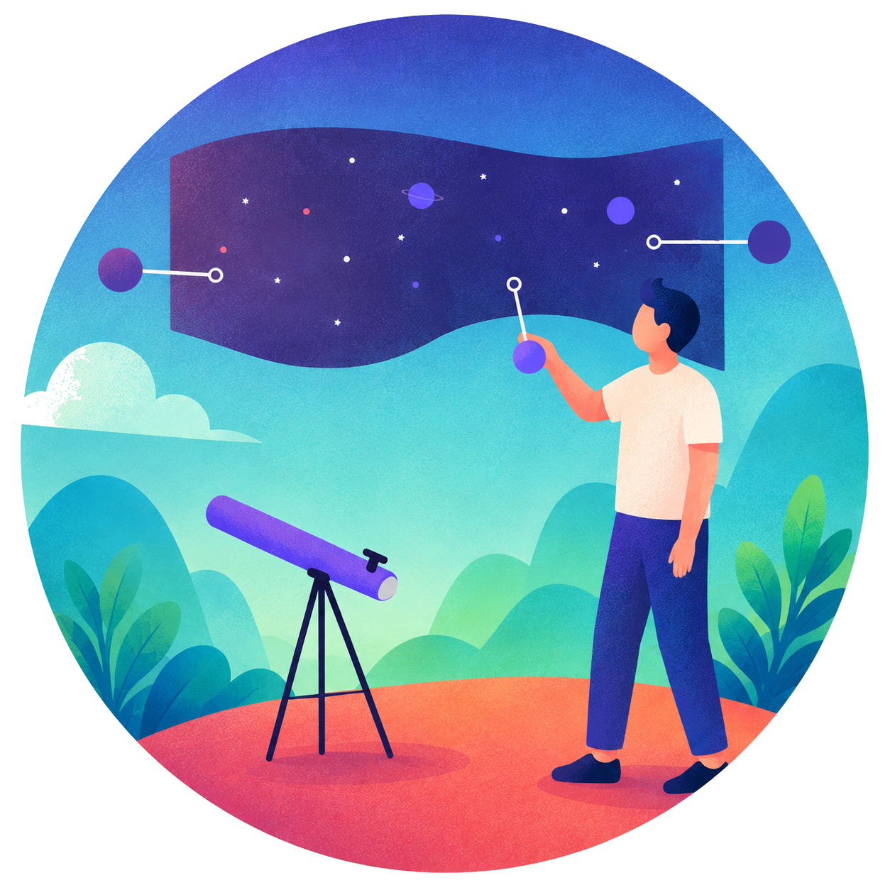
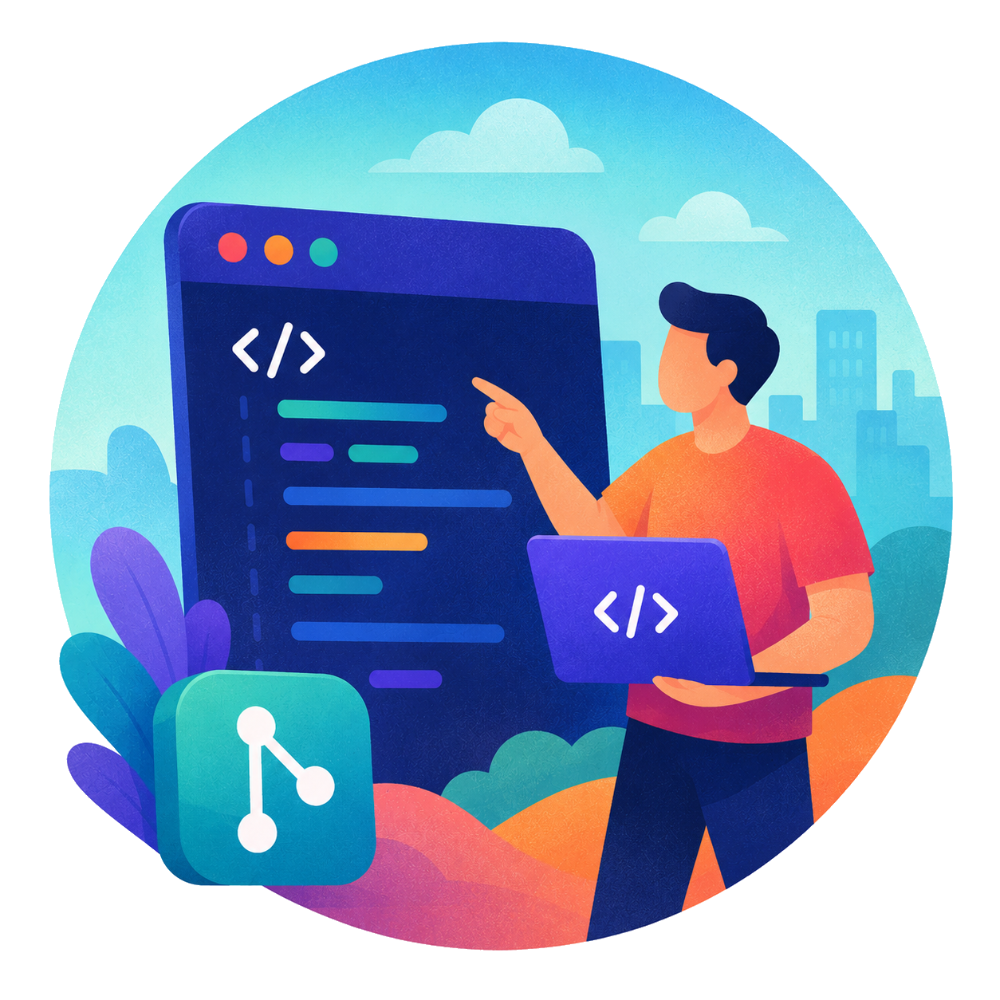

# Hi there, I'm Douglas Feitosa Romão 👋

> *Those who code philosophize; those who philosophize, develop.*

<table>
<tr>
<td width="64%" valign="top">

Postdoctoral researcher (FAPESP fellow) at FAU-USP, working at the intersection of <strong>digital humanities, philosophy of technology, and applied AI</strong>.

I build the systems I also write critically about: intelligent document processing, vector search, RAG, and agentic AI applied to born-digital archives.

Ph.D. and M.A. in Communication (UFF, with a doctoral research stay at Paris 1 Panthéon-Sorbonne / BnF) &middot; B.A. in Philosophy (USP).

My working thesis: editing a database's parameters is editing how we see, so I spend my days philosophizing about JOINs and OCR pipelines in more or less equal measure.

</td>
<td width="36%" valign="top" align="right">

</td>
</tr>
</table>

---

###  Currently building

| Project | What it does |
|---|---|
| **Agent Builder Acervos Digitais e Pesquisa (ArboreoLab Core)** | Multi-agent orchestration system — LangGraph, AIO V2 (inspired by Google A2A), FastAPI, Vue.js 3 |
| **Gerenciador Acervos Digitais e Pesquisa (ArboreoLab Core)** | Intelligent document-processing pipeline for digital archives (OCR, NER, RAG) |
| **[endpoints-clio-tainacan](https://github.com/douglasfeitosaromao/endpoints-clio-tainacan)** | REST API for digital collections, self-initiated during FAPESP Technical Training Fellowship 24/16083-7 |

###  Currently learning

How to make AI agent governance auditable, not just functional.

###  Looking to collaborate on

Open-source tooling for digital archives, cultural heritage collections, and archival AI workflows.

###  Looking for help with

Agentic AI evaluation, provenance tracking, and workflow design that survives real-world use - if this is your field, say hi.

###  Ask me about

Database aesthetics, RAG for archives, digital humanities, and 1920/30s German and British photojournalism (yes, really - long story, it's my PhD).

###  Find me elsewhere

⚡ **Fun fact:** my two academic lives — photojournalism history and AI infrastructure — turned out to be the same question asked twice: who gets to decide what an image means?

---

> [!NOTE]
> If you're looking for the tech executive and Microsoft MVP also named Douglas Romão — that's not me. I'm the one who footnotes his commits.
